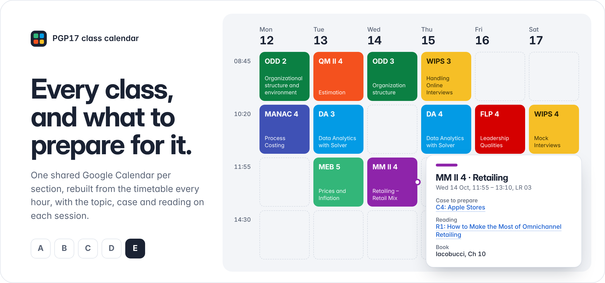
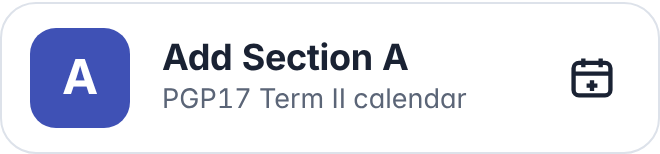
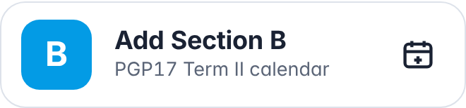
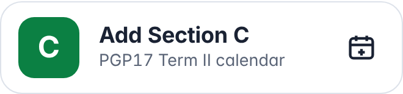
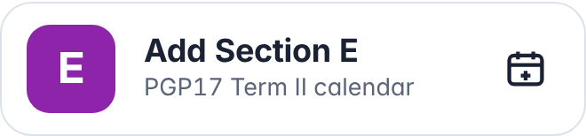
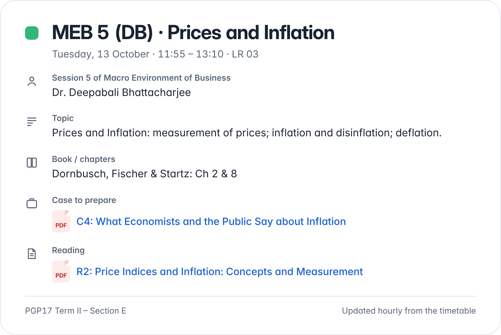
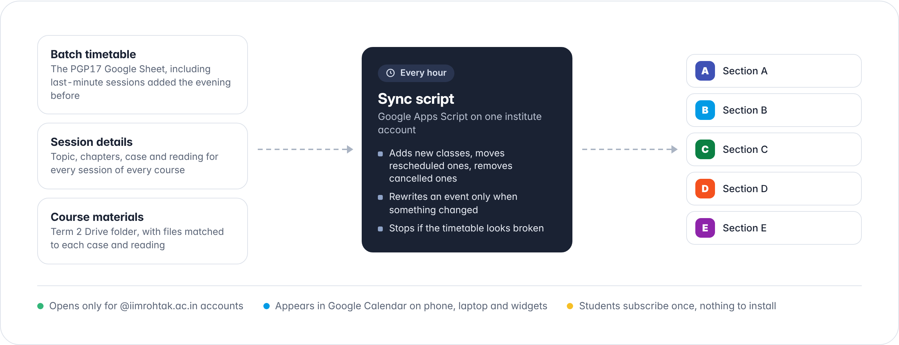

<p align="center">
  
</p>

<p align="center">
  
  
  
  
</p>

Every PGP17 Term II class for your section, in Google Calendar, with what to prepare for it. One shared calendar per section, rebuilt from the batch timetable every hour. Rescheduled, extra and cancelled classes follow automatically. Add it once; there's nothing to install.

## Add your section

Sign in with your **institute Google account**, then pick your section. The calendars only open for `@iimrohtak.ac.in` accounts.

<p>
  <a href="https://calendar.google.com/calendar/u/0?cid=Y182ZGJmMTc4ZTQ5MzU1YjI1YjZhOTkwMmQ5ODJmYzcwMDIxODdhNmEzZmVjOGE0OGM2M2Y4OGIwNDE5ZTYxMWNhQGdyb3VwLmNhbGVuZGFyLmdvb2dsZS5jb20"></a>
  <a href="https://calendar.google.com/calendar/u/0?cid=Y185NjNiYjkyNDQ3YmUxMzE3NzM0MmIxMTIxYzI2NTU1ZDI1MGUxYzA3ZDIyMDE0ZmEzNWUyZjFkNzIxZDE3MzZiQGdyb3VwLmNhbGVuZGFyLmdvb2dsZS5jb20"></a>
  <a href="https://calendar.google.com/calendar/u/0?cid=Y19hMTIzZTYwYzA2MjAwZWU1NjllNTI5Mzk3MTI4NzRhNmIyNTYyOWEwNWI4MmNlM2JjYTliNGM3N2M5ZTA0YmI1QGdyb3VwLmNhbGVuZGFyLmdvb2dsZS5jb20"></a>
  <a href="https://calendar.google.com/calendar/u/0?cid=Y18zN2M2MzEyZmFmMjViNzgwMGIyYjJiZWY4OWMwMTI3MDY4NWYxZTA5NDVmNDA0NTFmMzQ3MTY5YjExNTQ0MTdjQGdyb3VwLmNhbGVuZGFyLmdvb2dsZS5jb20"></a>
  <a href="https://calendar.google.com/calendar/u/0?cid=Y19lNTQxNjQ3MjNlMTE1ODJjZjc1MzQyOGNkY2ExMTcwNmVlMGIzYzM4MjM0YjhmYzk2ZTU0ZGMwOWNlNTg2ZmRlQGdyb3VwLmNhbGVuZGFyLmdvb2dsZS5jb20"></a>
</p>

<details>
<summary><b>On a laptop</b></summary>

1. Open [Google Calendar](https://calendar.google.com/) and check the account at the top right is your institute ID. Switch to it if needed.
2. Click your section's button above, then **Add**.
</details>

<details>
<summary><b>On an Android phone</b></summary>

1. Long-press your section's button above and open it in **Chrome**. If the Calendar app opens instead, go back.
2. In Chrome, tap **⋮** and tick **Desktop site**.
3. Check the account at the top right is your institute ID, then tap **Add**.
4. In the **Google Calendar app**, open **☰**. Under your institute account, make sure **PGP17 Term II – Section X** is ticked.
</details>

<details>
<summary><b>On an iPhone</b></summary>

iOS can't subscribe to a Google calendar from a link. Add it once from a laptop with your institute ID. Then sign in to the **Google Calendar app** on your iPhone with the same account, and the section calendar appears there.
</details>

<details>
<summary><b>Button didn't work? Add it by Calendar ID</b></summary>

In [Google Calendar](https://calendar.google.com/) on a laptop, choose **Other calendars → + → Subscribe to calendar**, then paste your section's ID:

| Section | Calendar ID |
| :-: | --- |
| A | `c_6dbf178e49355b25b6a9902d982fc7002187a6a3fec8a48c63f88b0419e611ca@group.calendar.google.com` |
| B | `c_963bb92447be13177342b1121c26555d250e1c07d22014fa35e2f1d721d1736b@group.calendar.google.com` |
| C | `c_a123e60c06200ee569e52939712874a6b25629a05b82ce3bca9b4c77c9e04bb5@group.calendar.google.com` |
| D | `c_37c6312faf25b7800b2b2bef89c01270685f1e0945f40451f347169b1154417c@group.calendar.google.com` |
| E | `c_e54164723e11582cf753428cdca11706ee0b3c38234b8fc96e54dc09ce586fde@group.calendar.google.com` |
</details>

## What's in every class



Open any class to see:

- the **topic** of that session and the **book chapters** to read
- the **case to prepare**, linked to its PDF in the course Drive folder
- the **reading** for the session, also linked
- the **faculty**, the **room** and the session number

Classes keep the timetable's short codes, like `MEB 5 (DB)`, so phone widgets stay readable, and each course has its own colour.

If a case shows *file not on Drive yet*, its PDF hasn't been uploaded. The link appears on its own once it is.

<br clear="right">

## Already set up the old version?

If you ran the **v1** script from this page in your own Apps Script project, switch it off. Otherwise every class shows twice.

1. Open [Google Apps Script](https://script.google.com/home) with your institute ID and open your v1 project (e.g. `My class calendar`).
2. Copy the code in **[v2/stop-v1.gs](v2/stop-v1.gs)** using the copy button next to **Raw**.
3. In your project, replace everything in `Code.gs` with it and click **Save**.
4. In the function menu, choose `stopV1AndClean`, click **Run**, and allow permissions if asked.

The log says `v1 stopped. Removed N upcoming class events…`. Only events created by v1 are removed. Your own events and past classes stay. Then add your section above.

## Put it on your home screen


**Android:** long-press the Home screen and choose **Widgets → Google Calendar → Calendar schedule**, then drag it out. Long-press it again to resize. ([Google's guide](https://support.google.com/calendar/answer/10249848?co=GENIE.Platform%3DAndroid&hl=en))

**iPhone:** open the Google Calendar app once. Then long-press the Home Screen and choose **Edit → Add Widget → Google Calendar**. ([Google's guide](https://support.google.com/calendar/answer/10249848?co=GENIE.Platform%3DiOS&hl=en))

**Reminders:** in Calendar settings, open *PGP17 Term II – Section X* and set **Event notifications**, for example 30 minutes before each class.

**More than one section added?** Untick the ones you don't need in the calendar list to hide them.

<br clear="right">

## How it works

<p align="center">
  
</p>

A Google Apps Script on one institute account reads three things every hour: the batch timetable, the session-details sheet built from the course outlines, and the Term 2 materials folder. It then updates the five section calendars:

- **Last-minute sessions:** it reads every class cell, including the afternoon slot and sessions added with their own time, like `Mcomm 1 (DS) (16:05-17:20)`.
- **Prep follows the session, not the date:** if MEB 4 moves from Monday to Thursday, its case and reading move with it.
- **Changes only:** an event is rewritten only when its time, topic or links actually change.
- **Safe by default:** if the timetable comes back broken or half-loaded, the run stops before touching any calendar.

## Troubleshooting

| What you see | What to do |
| --- | --- |
| *You do not have access* / can't add | You're signed in with a personal Gmail account. Switch to your institute ID. |
| Added, but nothing on your phone | In the Calendar app, open **☰** and tick *PGP17 Term II – Section X* under the institute account. |
| Every class shows twice | Your v1 script is still running. See [Already set up the old version?](#already-set-up-the-old-version) |
| A case link asks you to *request access* | Open it while signed in with your institute ID. |
| A class doesn't match the timetable | Calendars refresh hourly. If it's still wrong after an hour, tell the maintainer. |

## For maintainers

The whole system runs from one account. Setup, configuration and the session-details sheet are covered in **[v2/SETUP.md](v2/SETUP.md)**.

```
├── v2/
│   ├── Code.gs              sync script for all sections, runs hourly
│   ├── appsscript.json      manifest that turns on the Calendar API service
│   ├── stop-v1.gs           turns off a v1 install and removes its events
│   ├── SETUP.md             maintainer guide
│   └── tools/
│       └── build_details.py builds the session-details sheet from the prep plan
├── v1/                      original per-person script and its guide
├── images/                  README visuals
└── CHANGELOG.md
```

The private session-details sheet and materials folder IDs aren't stored here. See [CHANGELOG.md](CHANGELOG.md) for what changed in v2.

---

<p align="center"><sub>Made by <a href="https://github.com/parvnar">Parv Nar</a> for the PGP17 batch.</sub></p>
