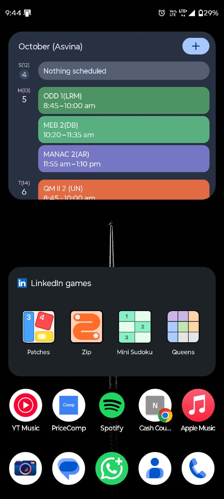
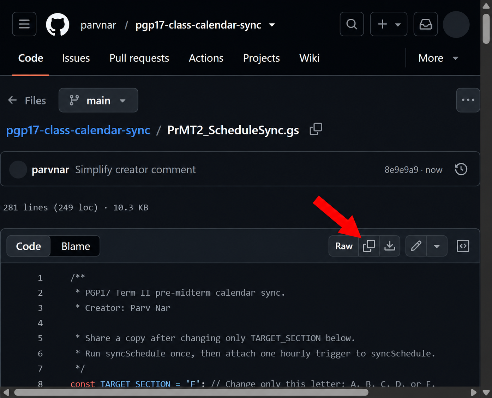
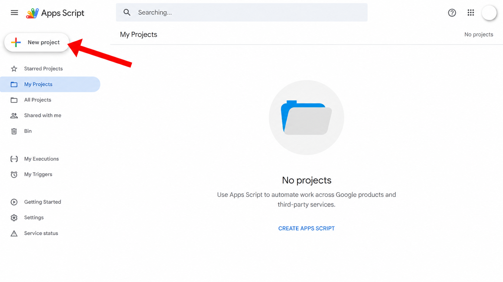
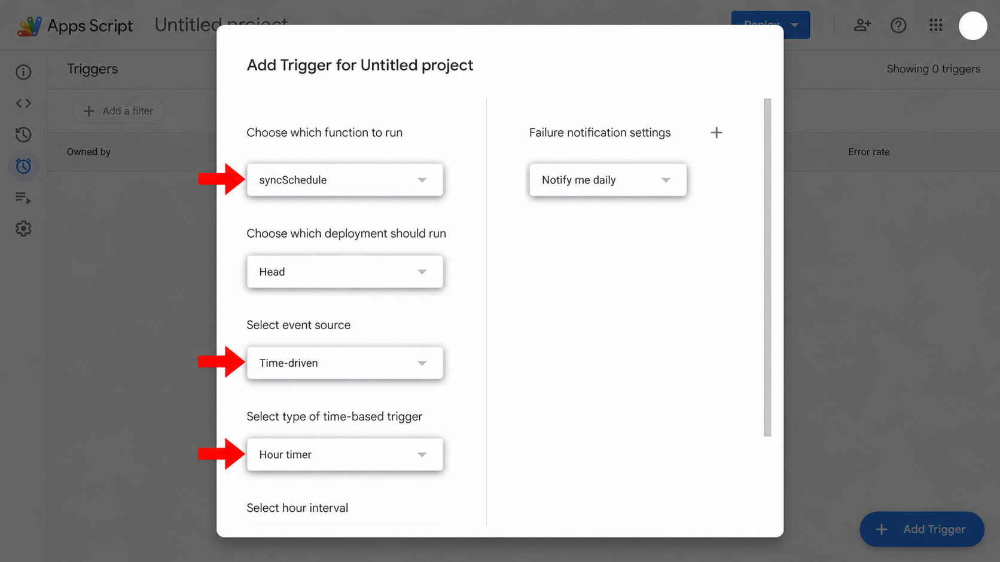
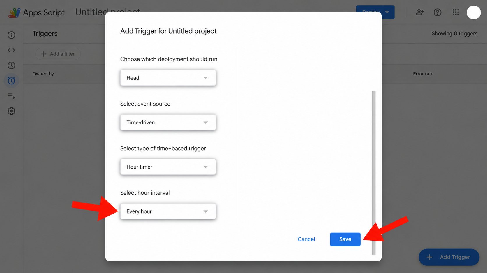

> **This is version 1**, kept for reference. It installs a personal copy of the script per person and adds only the subject and faculty to each class.
> **Use version 2 instead.** Subscribe to your section's shared calendar from the [main README](../README.md). It adds topic, case and reading links, and needs no setup.
> If you already set up v1, stop it by following [the main README](../README.md#already-set-up-the-old-version).

# PGP17 class calendar sync

Add your **Pre Mid Term 2 classes** to Google Calendar. The script checks the institute timetable about once an hour and updates future classes when the sheet changes.

**Made by Parv Nar.** Calendar titles are short for phone widgets. Open an event to see the full subject and faculty names.

### What you will see

Here is a real example on **Android** after the classes are added. Your colours and widget layout may look different, especially on iPhone.

## Before you start

✅ Use your **institute Google account**. It must open the [PGP17 timetable](https://docs.google.com/spreadsheets/d/1En591R2sVtII-zUMriVSKB0Pi7ZtLQxLbNDtS_OcGpQ/edit). Classes appear in **that account's calendar**.

✅ Know your section letter: **A, B, C, D, or E**.

✅ Use a computer for setup. Allow about **10 minutes**. You can view the calendar on your phone afterward.

## Set it up once

### 1 → Copy the script

1. Open **[PrMT2_ScheduleSync.gs](PrMT2_ScheduleSync.gs)**.
2. Find **Raw** above the code → click the **copy icon immediately beside it** (red arrow).

### 2 → Create a project

1. Sign in to your **institute Google account** → open [Google Apps Script](https://script.google.com/home).
2. Click **New project** (red arrow).

3. Open `Code.gs` → select and delete the starter code → **paste** the script you copied.
4. Click **Untitled project** at the top → name it `My class calendar`.

### 3 → Choose your section

1. Near the top of the code, find `const TARGET_SECTION = 'E';`.
2. Change **only the letter inside the quotes**. For Section B, use `const TARGET_SECTION = 'B';`.
3. Click **Save** (disk icon).

### 4 → Allow access on the first run

The script needs permission to **read the timetable** and **create, change, and remove events** in your institute account's Google Calendar. Google asks for this when you first run the project, even if you start with the preview.

1. At the top of the Apps Script editor, open the **function menu** → select `previewSchedule` → click **Run** (▶).
2. When **Authorization required** appears → click **Review permissions**.
3. Choose the **same institute Google account** used for the timetable.
4. Review the requested **Google Sheets** and **Google Calendar** access → select all required permissions if Google shows checkboxes → click **Allow**.
5. If Google shows **"Google hasn't verified this app"**, check that it is the project **you just created** from the script linked above. If you trust that code, click **Advanced** → **Go to My class calendar (unsafe)** → review the permissions → **Allow**. The project name may differ if you chose another name.

If the institute blocks authorization, contact its IT team. [Google's authorization guide](https://developers.google.com/apps-script/guides/services/authorization) explains why Apps Script asks for access.

### 5 → Check the preview, then add classes

1. Open **Execution log** at the bottom. `ADD` = new class, `UPDATE` = changed class, `REMOVE` = cancelled class. **Preview does not edit the calendar.**
2. If the preview looks right → function menu → `syncSchedule` → **Run** once.
3. Open [Google Calendar](https://calendar.google.com/) in the **institute account** → find a future class. A short title looks like `ODD 1(LRM)`; opening it shows the full subject, faculty, and © Parv Nar.

### 6 → Update automatically every hour

1. In Apps Script, click the **clock icon** on the left (**Triggers**) → **Add Trigger**.
2. Set **Function to run** → `syncSchedule`; **Event source** → **Time-driven**; **Type** → **Hour timer** (red arrows).

3. Scroll down → set **Hour interval** → **Every hour** → click **Save** (red arrows).

Add **one** hourly trigger. A timetable change usually appears after the next hourly run, not immediately.

## Put the class widget on your phone

First, open the **Google Calendar app** on your phone → tap your **profile photo** (top right) → **Add another account** → sign in with the same **institute account** you used for the script. Then tap **☰ Menu** (top left) → make sure the institute account's calendar is checked. Open a future class in the app before adding the widget. [Google's account steps](https://support.google.com/calendar/answer/15619834?hl=en)

### Android → add the schedule widget

1. Touch and hold an empty spot on the **Home screen** → tap **Widgets**.
2. Find **Google Calendar** → touch and hold **Calendar schedule** → drag it onto the Home screen. Choose **Calendar month view** instead if you prefer a month grid.
3. If you want to see more classes at once, touch and hold the new widget → drag its resize handles to make it taller.

[Google's Android widget guide](https://support.google.com/calendar/answer/10249848?co=GENIE.Platform%3DAndroid&hl=en) notes that the menu can vary slightly by phone.

### iPhone → add the Google Calendar widget

1. Install and open the **Google Calendar app** once. In the app, check that your institute calendar and its classes are visible.
2. Touch and hold an empty spot on the **Home Screen** → tap **Edit** → **Add Widget** (or the **+** button, depending on iOS).
3. Search for **Google Calendar** → choose a widget size → tap **Add Widget** → **Done**.

If Google Calendar is missing from the widget list, open the app once and try again. [Google's iPhone widget guide](https://support.google.com/calendar/answer/10249848?co=GENIE.Platform%3DiOS&hl=en)

The widget shows events from the calendars enabled in the Google Calendar app. Its colours and number of visible classes may vary by phone and widget size.

## If something goes wrong

| What you see | What to do |
| --- | --- |
| No classes | Google Calendar → switch to the **institute account** → run `syncSchedule` again → check **Execution log**. |
| Permission or access error | Open the [institute timetable](https://docs.google.com/spreadsheets/d/1En591R2sVtII-zUMriVSKB0Pi7ZtLQxLbNDtS_OcGpQ/edit) with the **same account**. If Apps Script is blocked, contact institute IT. |
| Wrong section | Change the one `TARGET_SECTION` letter → **Save** → run `previewSchedule` → run `syncSchedule`. |
| Timetable looks incomplete | Check whether the live sheet loads fully. The script makes no calendar changes if it cannot read enough rows. |
| No upcoming dates | This version covers **1 October to 21 November 2026** only. |

If you used the older **Section E** script in the *same* Apps Script project, it may already have an hourly trigger. Check **Triggers** before adding another.

## For another section

Make a **new Apps Script project** → paste the same script → change only `TARGET_SECTION` → follow the permission, preview, and trigger steps above. Every copy needs access to the institute timetable.

The private timetable is not stored in this repository. Start with `previewSchedule` on the live sheet.
